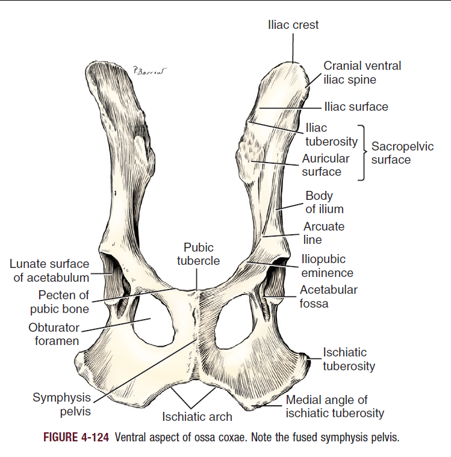

Radiographs of pelvis - usually VD and lateral
* If VD, then do either flexed (frog-leg projection) or extended
* If lateral, then do one leg cranially and one leg caudally to avoid superimposition of femurs

Pelvis
* Comprised of 4 bones 1) ilium 2) ischium 3) pubic bone and 4) acetabular
  * Acetabular - triangle bone between ilium and ischium which fuses with adjacent bones around 12 weeks of age to form ventral aspect of acetabulum
  * Before fusing will have a lot of radiolucent junctions
    * 1) Between cranial acetabular and ilium
      2) Between caudal acetabular and ischium
      3) Dorsal to acetabular bone between ilium and ischium
    * Can make it hard to identify acetabular bone in its entirety
    * Need to be careful to not diagnose fractures in this region in really young animals (can also have 💩 superimposition that leads to misdiagnosis of fractures)
   
Sacroiliac joint
* Combined synovial and cartilaginous joint united by thin joint capsule
* Union between sacrum and ilium is a *synchondrosis*
* Cartilage creates radiolucency which persists throughout life -> **not** a fracture; look at smooth transition between ilium and sacrum
* Character of transition between ilium and sacrum key to detecting sacroiliac subluxation

Ilium
* Divided subjectively into cranial wing and caudal body
* Iliac crest is most cranial part and is fused with wing in most dogs by 2 years of age but 10% incompletely fuse and will see it as radiolucency between the two -> **not** a fracture
* In VD iliac crest is superimposed on wing of ilium and incomplete union not usually visible unless slight obliquity

Acetabulum
* Made up of ilium, ischium, and pubic bone
* Has nonarticular depression called the *acetabular fossa* (see it best on VD)
* Don’t actually look at this area when evaluating for hip dysplasia (when hips extended in VD) - should evaluate cranial to the acetabulum - corresponds to cranial 1/3rd of joint space
* Acetabular fossa disrupts smooth articulation between femoral head and acetabulum (don’t evaluate it)
* In some young dogs, small separate center of ossification at craniolateral margin of acetabulum
  * Eventually fuse with ilium
  * **Not to be confused with a fracture fragment**
 
Supplementary Acetabular Projections
* Dorsal Acetabular Rim View (DAR)
  * Anesthetized patient placed sternally with limbs pulled cranially
  * Center of beam should pass through long axis of ilial shaft and result in superimposition of wings of ilium, body of ilium, acetabulum, and tuber ischii-> unobstructed view of dorsal rim of acetabulum
* Open-leg Lateral
  * Oblique unobstructed lateral view of the acetabulum and femoral head
  * Patient placed laterally with leg of interest *down* and non-dependent leg up and laterally so that final position is dorsal to the spine
  * Can then see unobstructed lateral view of acetabulum and proximal femur

Ischium
* Composed of body, ramus, tuberosity
* Contributes to formation of acetabulum, obturator foramen, and pubic symphysis
* Pubic symphysis
  * Fibrous union in most dogs < 5 years of age
  * Before fusion is radiolucent (not a fracture)
  * Sometimes hard to tell what’s going on in male dogs with poop and os penis
  * Can’t really see in lateral
* Ischiatic tuberosity
  * Separate ossification center
  * Ossification center starts to fuse to ischium and cartilaginous tuber ischii continues medially
  * Some dogs will have another ossification center at caudal aspect of pubic symphysis associated with ischiatic arch
  * On lateral, secondary ossification centers can easily be confused as a fracture
 

Pubic Bone
* Composed of 2 rami and a body
* Pubic bone and ischium bound obturator foramen -> assessing symmetry helps with evaluating for rotation of the pelvis
* Pelvis that is rotated has obturator appearing bigger and coxofemoral joint appears to have greater depth and congruency and iliac crest appears wider because it is struck more en face by primary x-ray beam

Etc
* Os penis & prepuce are superimposed on pelvis in VD views
  * Opacity could be confused with abdominal mass and can interfere with interpretation of pelvis
* Anal sacs can occasionally contain gas and then be superimposed on radiographs, resulting in focal radiolucency confused as bone lesion
  * Usu superimposes on ischium and placement can vary from medial aspect of acetabulum to region of tuber ischii
 
🐈: has more rectangular pelvis with slightly longer ischium with respect to ilium
