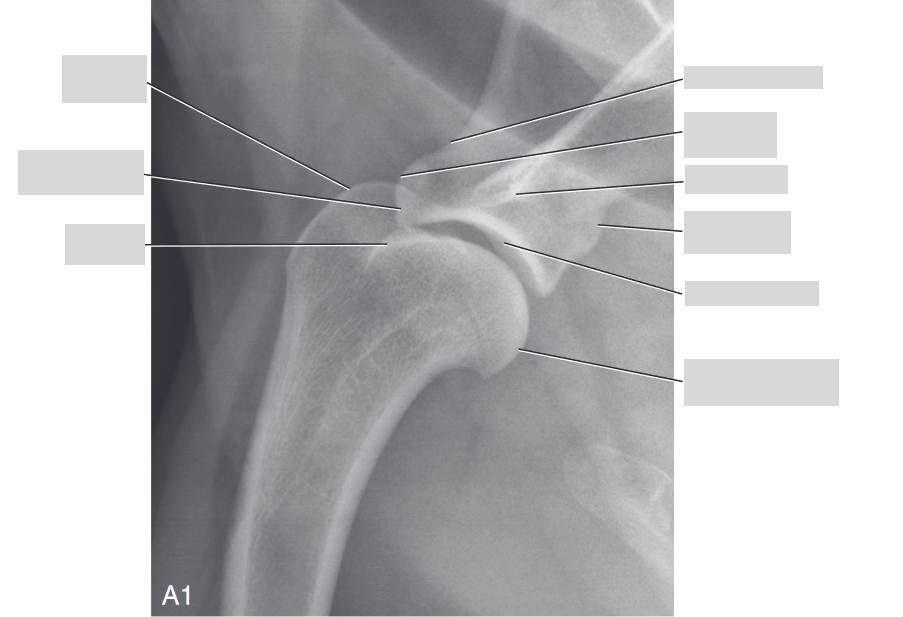
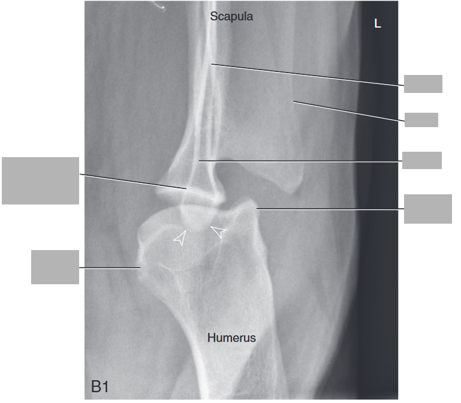
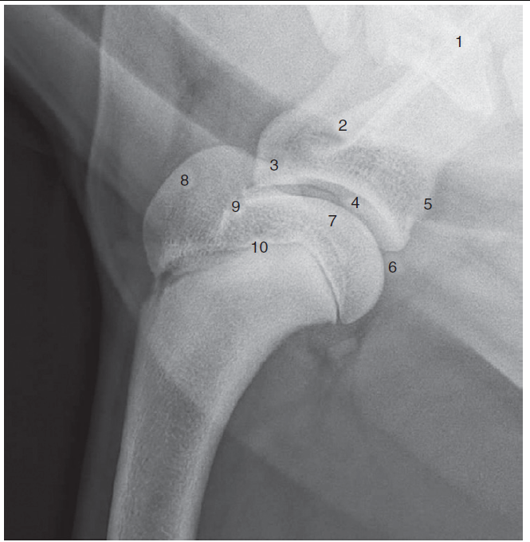
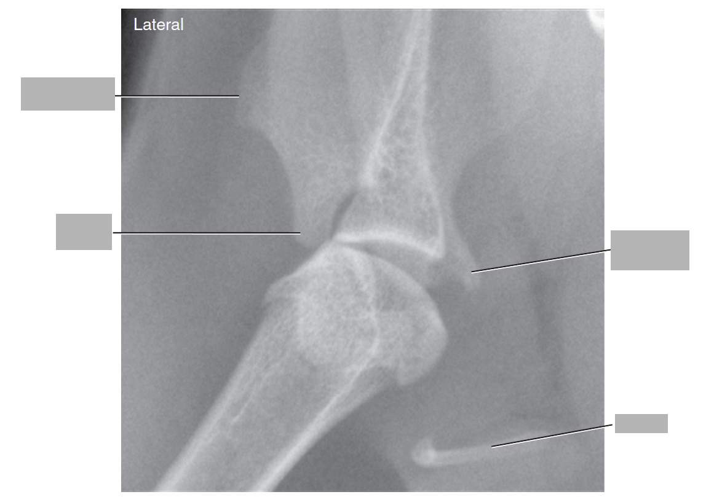

# The Scapula and Brachium
* Scapula - largest bone in the shoulder, varies in position with respect to spinal cord a whole lot
* Distal parts - acromion, scapular notch, shoulder joint, supraglenoid tubercle (where biceps attaches), coracoid process
* Infrequently have incomplete ossification at distal aspect of canine acromion
* 🐈: coracoid process more developed than dog, acromion has hamate process and suprahamate process
  * May have separate ossification center at caudal aspect of glenoid cavity which can be hard to differeniate from an osteophyte
* Clavicle in dog is rudimentary, might only been seen on VD/DV in body of brachiocephalicus
  * 🐈has much more developed clavicle and can be seen in both lateral or VD, could be confused with eosphageal FB if poorly positioned
* When radiographing, tendency to abduct limb which can make it seem like medial joint is disrupted
* Lateral rads are best taken with limb of interest closest to the film/sensor with head extended dorsally and other limb caudally
* To get Cr-Cd view, have animal on dorsal and extend limb cranially
* To get lateral and oblique views WITHOUT spine, hard to do but can put in lateral with limb of interest uppermost, flex head and neck with elbow directed dorsally to force scapula dorsal to the cranial aspect of the thoracic spine - get slightly oblique view but no spine superimposition
* Shoulder lameness is common so lateral of shoulder is commonly shot but sometimes limb isn’t pulled cranioventrally enough and there’s superimposition of head of humerus with manubrium
* Biceps tendon originates from supraglenoid tubercle and extends laterally next to greater tubercle and smaller medially lesser tubercle
  * Cranioproximal-craniodistal oblique view to see the greater and lesser tubercles -> assess for secondary changes from bicipital tenosynovitis
* Sometimes ill-defined lucency noted at base of greater tubercle; unknown precisely what it is but questionable (probably none) clinical significance
* Greater and lesser tubercles and humeral head together make up proximal humeral epiphysis which can look quite funky when fusing (usually closed by 12-18 months) but variable timing
* Supraglenoid of scapula also develops separately as ossification center (closes at 4-7 months)
* In mature patient, small triangular region of fat is often present behind caudal humeral head - occ axillobrachial vein, caudal circumflex humeral artery, and branch of the axillary nerve visible within the fat and look like circular opacities --> not joint mice, normal
* Humeral shaft - smooth except for deltoid tuberosity from lateral aspect mid-diaphysis 
  * *Tricipital line* is line of increased opacity from caudal aspect of greater tubercle down to deltoid tuberosity
  * Small tuberosity on deltoid tuberosity is where teres major attaches mid-tuberosity
  * Nutrient canal readily apparent on lateral - not cortical fracture
* 🐈
  * Nutrient canal medial cortex (vs caudally in dog), usually not seen
  * Feline humerus is straighter and more uniform compared to dogs
* Chondrodystrophic animals
  * Humeral head is flatter
  * Diaphysis is shorter, curved
  * Bulbous nature of humeral head and lipping of caudal humeral head can be misinterpreted as osteophytosis

## Osteochondrosis
* Common in canine shoulder
* Can be seen with traditional lateral but sometimes slightly medial to true caudal aspect of humerus and is not seen on lateral
* Can see caudolateral or caudomedial aspect of humerus by rotating forelimb medially or laterally (respectfully)

## Name the parts

