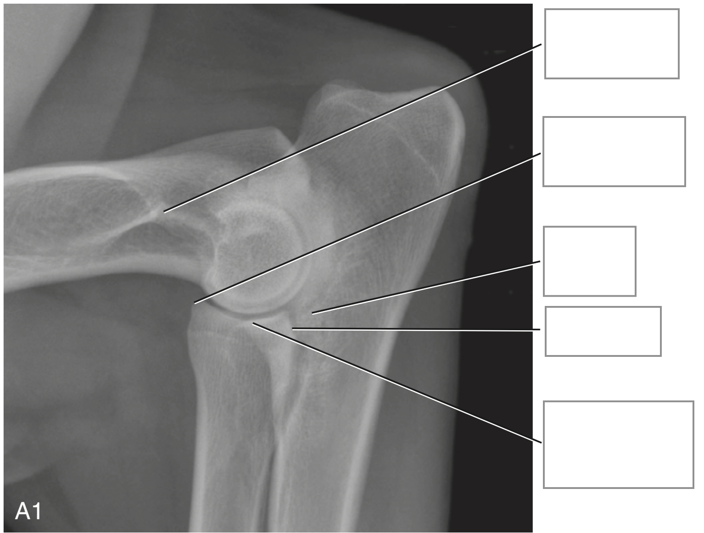
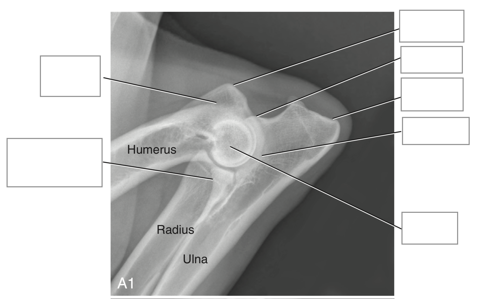
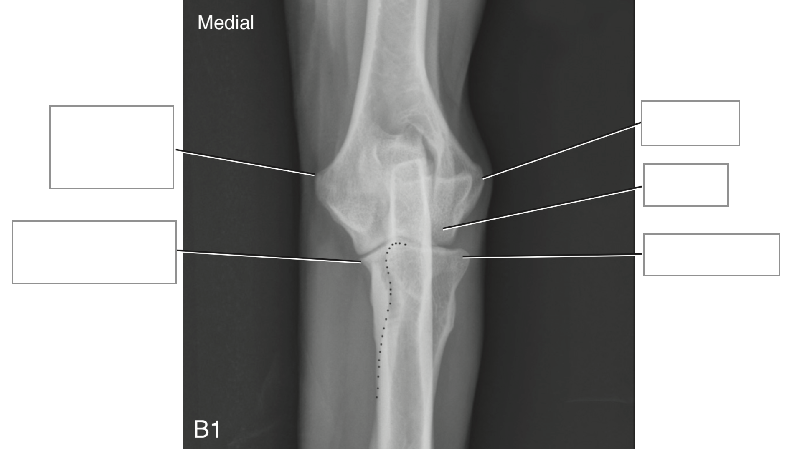

* Unique - 3 long bones must grow perfectly together to ensure normal joint conformation
* Standard radiographic view is with brachium and antebrachium at 90 degrees from each other for the lateral (neutral and flexed) and cr-cd view

* Humerus distally - 2 condyles (medial and lateral)